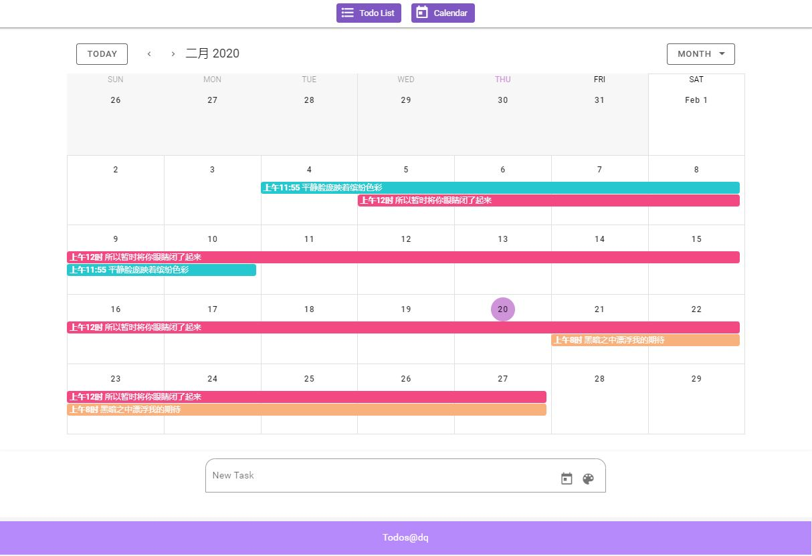
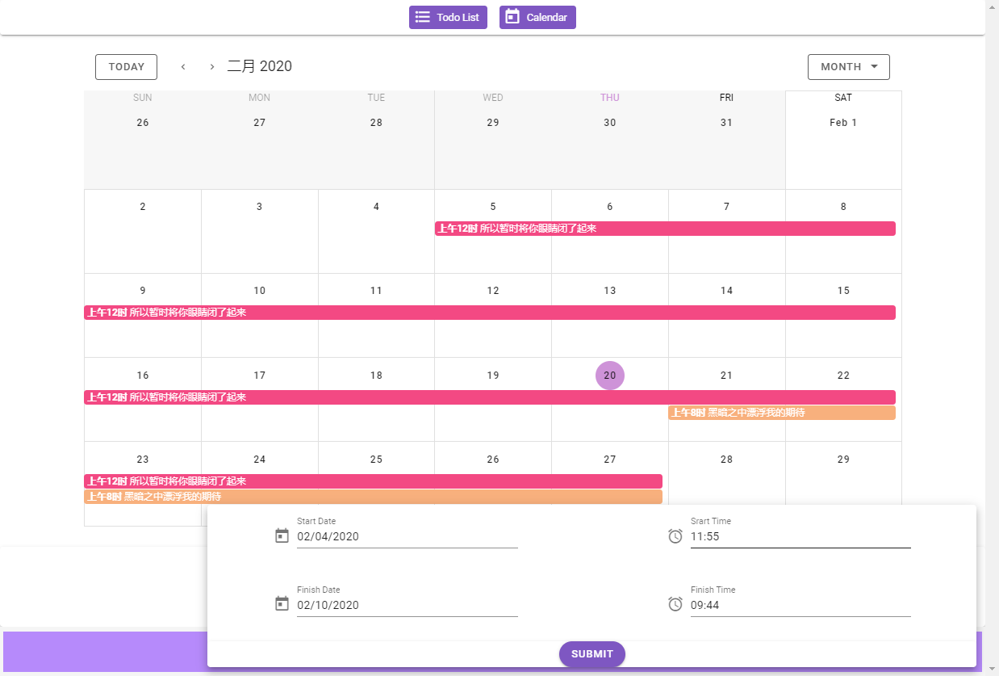
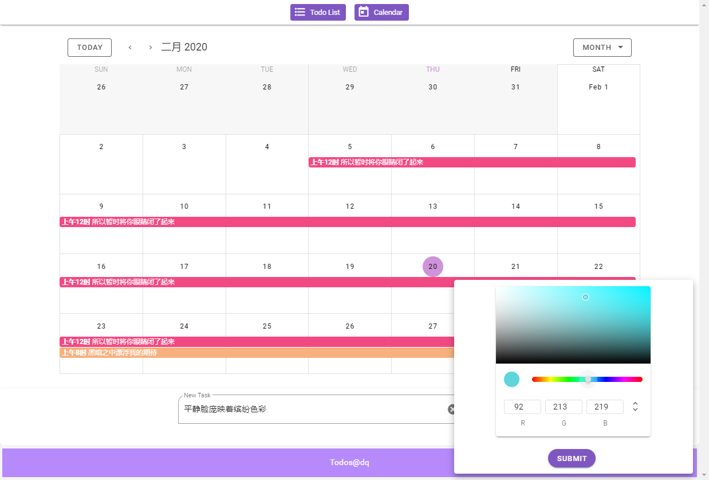
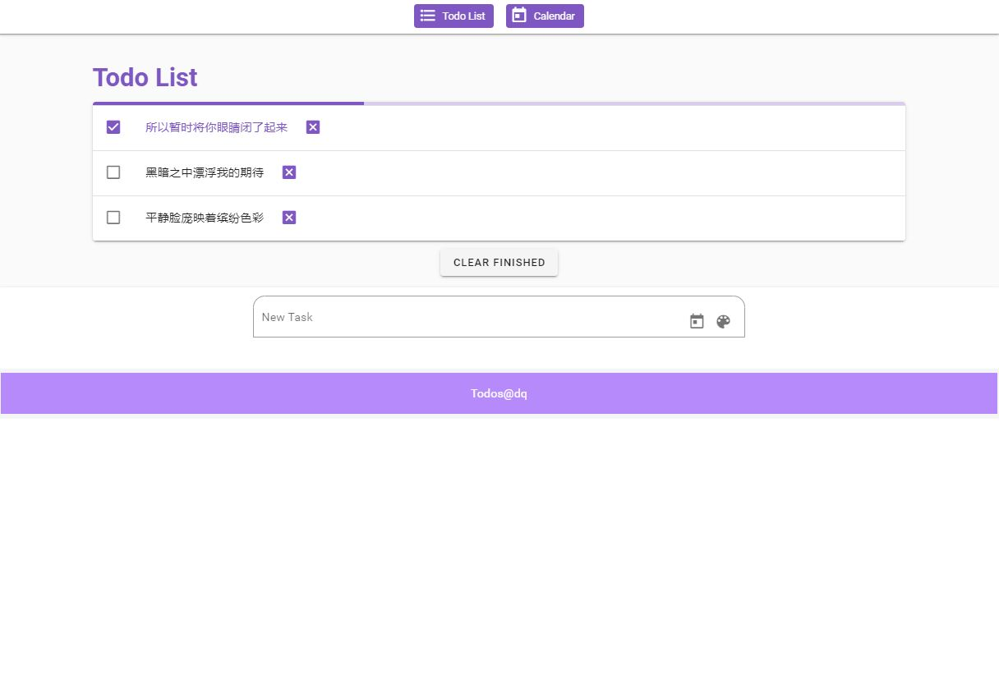

# todos

### Introduction
- A demo to practice Vue2, Vue CLI3, Vue router, Vuex, Vuetify, webpack and so on.

- A useful calendar view to arrange your schedule.



- Add todos to the **calender**, indicating the **start time and finish time**. 



- You can choose the **event color** by clicking the palette icon.



- See your todos in a list, and tick tho one you have finished,you will get your **progress** in the progress-bar.



### Setup
```bash
# Project setup
npm install

# Compiles and hot-reloads for development
npm run serve

# Compiles and minifies for production
npm run build

# Lints and fixes files
npm run lint
```

### technology stack

- **Vue2**:Use the lastest vue2 syntax
- **Vuex**:A centralized store for all the components in an application, with rules ensuring that the state can only be mutated in a predictable fashion.
- **vue-router**:A front-end router to switch between todo list view and calendar view. 
- **Webpack**:A module bundler included in Vue CLI.
- **Vuetify**:A componennt library for Vue.js.
- **Vue CLI3**:A command line interface to simplify the build of Vue project.
